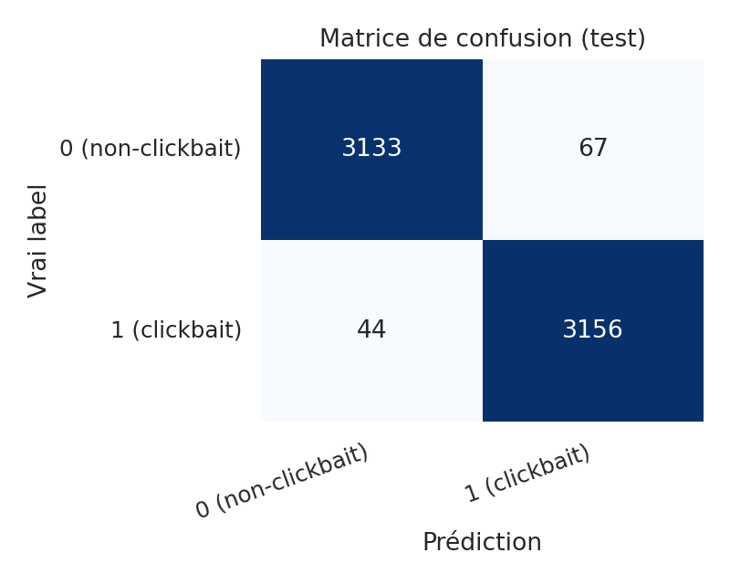

# Traitement statistique des données - Clickbait / pièges à clics

> Lena Baraquin & Morgane Bona-Pellissier (Master 1 pluriTAL)

---

## Courte introduction
Le concept de « piège à clics » (*clickbait* en anglais) est défini par le ministère de la Culture français comme un « [l]ien hypertextuel accrocheur conduisant à un contenu qui n’est qu’un leurre, mis en place à seule fin d’augmenter le trafic en incitant les internautes à cliquer ; par extension, le contenu lui-même ». Du point de vue des sciences de l’information, les travaux sur la manipulation de l’information proposent un cadre pour distinguer et ordonner différentes formes de distorsion (exactitude, intention, modalités d’énonciation, etc.) tout à fait utile pour situer le phénomène de *clickbait* dans un spectre plus large que la seule « infox » ou fake news explicite (Rubin et Chen, 2012).

En traitement automatique du langage, le phénomène est surtout traité comme une classification de textes courts (titres, posts). Bien que des travaux récents analysent des stratégies linguistiques fines et explorent l’explicabilité des décisions des modèles (Nofar et al., 2025), le présent rapport se limite à une classification supervisée strictement binaire (clickbait / non-clickbait) sur des titres en anglais, avec des algorithmes classiques comparés entre eux.

Enfin, il importe de rappeler que cette tâche s’inscrit néanmoins dans des enjeux plus larges de crédibilité et de manipulation médiatique.


*Légende : collage illustrant des titres « piège à clics » - Source : Wikipedia.*

## Objectifs

- Classifier automatiquement des titres d’articles en anglais en deux catégories : **non-clickbait** (0) vs **clickbait** (1) ;
- comparer plusieurs algorithmes (consigne : au moins deux parmi Naive Bayes, SVM, arbre de décision) ;
- commenter les performances et les erreurs typiques.

---

## Données et ressources

| Élément | Détail |
|--------|--------|
| Fichier | `clickbait_data.csv` (UTF-8) |
| Source | jeu Kaggle (https://www.kaggle.com/datasets/amananandrai/clickbait-dataset) |
| Contenu | une ligne = un titre ; colonnes `headline` (texte), `clickbait` (0 ou 1) |
| Volume total | 32 000 titres |
| Répartition | 16 001 non-clickbait / 15 999 clickbait -> corpus équilibré |
| Taille des documents | titres courts uniquement (pas d’article complet) ; longueurs analysées en EDA (`scripts/1_eda.py`) |

---

## Méthodologie

### Découpage train / test
Les données ont été divisées en **deux partitions *train* et *test* (80 % / 20 %)**, de façon stratifiée sur le label `clickbait` et avec **`random_state=42`**, de sorte que le même découpage soit rejoué partout. Ainsi, les partitions *train* et *test* gardaient chacune à peu près la même proportion de 0 et de 1 que le jeu complet (via `stratify=y` dans `train_test_split`), évitant ainsi qu’un tirage aléatoire ne crée un bloc nettement plus riche en une classe que l’autre. Dans le code, cet appel est regroupé dans une fonction **`make_split`** dont la logique est reprise dans plusieurs scripts pour rester alignés sur ce split.

```python
# scripts/2_features.py — fonction make_split (aperçu)
def make_split(df: pd.DataFrame) -> SplitData:
    X = df["headline"].astype(str)
    y = df["clickbait"].to_numpy(dtype=int)
    X_train, X_test, y_train, y_test = train_test_split(
        X, y, test_size=0.2, random_state=42, stratify=y,
    )
    return SplitData(X_train=X_train, X_test=X_test, y_train=y_train, y_test=y_test)
```

### Absence de dev
Nous n'avons pas utilisé de troisième ensemble « validation / dev » en tant que tel et n'avons donc pas réservé de sous-échantillon fixe entre train et test. En effet, le *test* (20 %) a servi de *hold-out* final pour les métriques (rapport, matrice de confusion dans `4_evaluate.py`, analyses dans `5_analysis.py`), toujours avec le même `seed` pour reproduire exactement les mêmes exemples en train vs test. Autrement dit, ces exemples de test n’entraient pas dans l’apprentissage du modèle ni dans la validation croisée sur le train et n'étaient consultés qu’une seule fois, pour mesurer les performances après coup, afin que le score reflète le mieux possible la capacité de généralisation et non un biais d’« entraînement sur le test ».


### Validation croisée (à 5 plis)

À l’étape 3 (`scripts/3_models.py`), la fonction `evaluate_model` enchaîne deux évaluations distinctes pour chaque pipeline (vectorisation + classifieur), toutes deux inscrites dans le tableau de synthèse ci-dessous.

1. **Validation croisée** (colonnes *Acc. (CV)* et *F1 macro (CV)*) : Une validation croisée stratifiée à cinq plis (ou *5-fold cross validation* / CV) est appliquée uniquement sur `X_train` / `y_train`. Le *train* est découpé en cinq parts ; à chaque pli, le modèle s’entraîne sur quatre parts et est noté sur la cinquième, puis les cinq scores sont moyennés. Le jeu de test n’intervient à aucun moment dans cette boucle : il ne sert ni à l’apprentissage ni au calcul des métriques CV. Cette étape tient lieu de validation pour comparer les pipelines et lisser le hasard du découpage, sans équivalent d’un fichier *dev* séparé tenu à part.

2. **Évaluation sur le hold-out** (colonnes *Acc. (test)* et *F1 macro (test)*) : Après la CV, le même pipeline est entraîné une dernière fois sur l’intégralité du train (`fit` sur tout `X_train`), puis évalué une fois sur le jeu de test (`predict` sur `X_test`). Ce sont ces scores qui remplissent les colonnes « test » du tableau et qui servent notamment au tri des lignes (meilleur F1 macro sur le test en tête). Le test est donc utilisé seulement pour cette mesure finale par pipeline.

```python
# scripts/3_models.py — evaluate_model (extrait)
cv = StratifiedKFold(n_splits=5, shuffle=True, random_state=42)
cv_scores = cross_validate(pipe, split.X_train, split.y_train, cv=cv,
    scoring={"accuracy": "accuracy", "f1_macro": "f1_macro"})
pipe.fit(split.X_train, split.y_train)
y_pred = pipe.predict(split.X_test)
```

| Modèle | Acc. (CV) | F1 macro (CV) | Acc. (test) | F1 macro (test) |
|--------|-----------|---------------|-------------|-----------------|
| LinearSVC — TF-IDF + manuels | 0,9812 | 0,9812 | 0,9827 | 0,9827 |
| LinearSVC — BoW + manuels | 0,9752 | 0,9752 | 0,9794 | 0,9794 |
| MultinomialNB — BoW + manuels | 0,9602 | 0,9602 | 0,9636 | 0,9636 |
| MultinomialNB — TF-IDF | 0,9586 | 0,9586 | 0,9625 | 0,9625 |
| MultinomialNB — BoW | 0,9590 | 0,9590 | 0,9609 | 0,9609 |
| LinearSVC — TF-IDF | 0,9564 | 0,9564 | 0,9598 | 0,9598 |
| MultinomialNB — TF-IDF + manuels | 0,9543 | 0,9543 | 0,9594 | 0,9594 |
| LinearSVC — BoW | 0,9486 | 0,9486 | 0,9553 | 0,9553 |
| DecisionTree — BoW + manuels | 0,9356 | 0,9356 | 0,9380 | 0,9380 |
| DecisionTree — TF-IDF + manuels | 0,9345 | 0,9345 | 0,9344 | 0,9344 |
| DecisionTree — BoW | 0,7640 | 0,7535 | 0,7628 | 0,7519 |
| DecisionTree — TF-IDF | 0,7634 | 0,7529 | 0,7620 | 0,7510 |

### Choix du meilleur pipeline et évaluation finale

L’étape 4 (`scripts/4_evaluate.py`) s’appuie sur le fichier `artifacts/step3/best_model.joblib` produit à l’étape 3 (pipeline classé premier après tri du tableau de synthèse).

```python
# scripts/3_models.py - tri du tableau de synthèse et choix du pipeline sauvegardé (extrait)
summary = pd.DataFrame(
    [
        {
            "modèle": r["model"],
            "cv_accuracy": r["cv_accuracy"],
            "cv_f1_macro": r["cv_f1_macro"],
            "test_accuracy": r["test_accuracy"],
            "test_f1_macro": r["test_f1_macro"],
        }
        for r in results
    ]
).sort_values(["test_f1_macro", "test_accuracy"], ascending=False)
best_name = summary.iloc[0]["modèle"]
best = next(r for r in results if r["model"] == best_name)
dump(best["estimator"], ARTIFACTS_DIR / "best_model.joblib")
```

Cette étape recalcule le découpage train/test avec la même fonction `make_split` et les mêmes hyperparamètres qu’aux étapes précédentes, charge le pipeline sauvegardé sans nouvel apprentissage, puis applique `predict` uniquement à `X_test`. Les sorties regroupent les indicateurs usuels (exactitude, F1 macro, rapport de classification) et des artefacts dans `artifacts/step4/` : scores tabulés, rapport texte et matrice de confusion au format image. Il s’agit d’une évaluation figée sur le hold-out, distincte du bloc d’entraînement / validation de l’étape 3. L’extrait ci-dessous reprend l’ordre réel des blocs dans le script (les détails d’affichage console et le tracé de la heatmap sont omis).

```python
# scripts/4_evaluate.py — ordre des opérations (extrait)
split = make_split(load_data())
model = load(MODEL_PATH)  # aucun fit : pipeline déjà entraîné à l’étape 3
y_pred = model.predict(split.X_test)
acc = accuracy_score(split.y_test, y_pred)
f1m = f1_score(split.y_test, y_pred, average="macro")
report = classification_report(split.y_test, y_pred, digits=3)
cm = confusion_matrix(split.y_test, y_pred)
# écritures dans artifacts/step4/ : classification_report.txt, scores.csv, confusion_matrix.png
```

---

## Modèles testés
Modèles testés (parmi autres) : **MultinomialNB**, **LinearSVC**, **DecisionTreeClassifier**, combinés à BoW ou TF-IDF, avec ou sans traits manuels. Hyperparamètres de référence : ex. `LinearSVC(C=1.0, max_iter=20000)`, `MultinomialNB(alpha=1.0)`, arbre avec profondeur et `min_samples_split` fixés pour limiter le sur-apprentissage. Tableau complet : `artifacts/step3/summary.csv`.

```python
from sklearn.naive_bayes import MultinomialNB
from sklearn.svm import LinearSVC
from sklearn.tree import DecisionTreeClassifier

# Définition des modèles (baseline NB, modèle fort SVM, et arbre en comparaison)
models = {
    "MultinomialNB": MultinomialNB(alpha=1.0), # Lissage de Laplace
    "LinearSVC": LinearSVC(C=1.0, max_iter=20000), # classifieur linéaire sur vecteurs BoW ou TF-IDF
    "DecisionTree": DecisionTreeClassifier(
        random_state=42,
        max_depth=30,
        min_samples_split=10,
    ),
}
```

### MultinomialNB

### LinearSVC

### DecisionTreeClassifier

---

## Résultats quantitatifs

**Meilleur pipeline** (sélectionné par F1 macro sur le test à l’étape 3) : **LinearSVC | TF-IDF + traits manuels**.

| Indicateur | Valeur (jeu de test, *n* = 6 400) |
|------------|-------------------------------------|
| Accuracy | **0,9842** |
| F1 macro | **0,9842** |

**Par classe** (rapport de classification sur le test) :

| Classe | Précision | Rappel | F1 |
|--------|-----------|--------|-----|
| 0 (non-clickbait) | 0,986 | **0,982** | 0,984 |
| 1 (clickbait) | 0,982 | **0,987** | 0,984 |

**Autres modèles** (aperçu - détail dans `summary.csv`) : MultinomialNB et arbres sont nettement au-dessous du SVM linéaire sur ce corpus ; les arbres sans traits manuels ou avec TF-IDF seuls peuvent fortement se dégrader.

---

## Commentaire et interprétation (brouillon)

- Les deux classes obtiennent des scores très proches ; le **rappel** est légèrement plus faible pour la classe **0** que pour la **1** : un peu plus d’erreurs où un titre réel est pris pour du clickbait que l’inverse.  
- Les **faux positifs** (ex. titres factuels avec formulation interrogative ou « accroche ») montrent que la frontière n’est pas purement lexicale : la presse utilise aussi des formulations « engageantes ».  
- Les **faux négatifs** incluent souvent des titres **très courts** ou ambigus (*Memory Loss*, *The Tennis Racket*), où les indices associés au clickbait dans le corpus sont peu présents.  
- Les **coefficients** du `LinearSVC` (`artifacts/step5/top_features.txt`) associent plutôt au clickbait des marqueurs de style (majuscules, termes type quiz/listicle) et au non-clickbait un vocabulaire plus « une factuelle » (économie, politique, etc.). Il s'agit des corrélations observées sur ce jeu et non d'une définition universelle du journalisme. La généralisation à d'autres sources n'est donc pas garantie.
- **Prudence** : les scores ~98 % sont élevés (cohérents avec un corpus binaire bien séparé)

### Matrice de confusion (jeu de test)



### Exemples d’erreurs (fichiers `artifacts/step5/false_positives.csv` et `false_negatives.csv`)

**Faux positifs** : vrai label *non-clickbait* (0), prédiction *clickbait* (1)

| Titre |
|-------|
| What Is Facebook Actually Worth? |
| Star Wars III premieres at Cannes |
| Happy Gilmore Was On to Something |

**Faux négatifs** : vrai label *clickbait* (1), prédiction *non-clickbait* (0)

| Titre |
|-------|
| Memory Loss |
| The Tennis Racket |
| Whose Concert Tour Should You Open For |

## Bibliographie
> van der Goot, R. (2021). *We Need to Talk About train-dev-test Splits*. In *Proceedings of the 2021 Conference on Empirical Methods in Natural Language Processing (EMNLP)*, p. 4485–4494.
>
> Rubin, V. L., & Chen, Y. (2012). Information Manipulation Classification Theory for LIS and NLP. In *Proceedings of the Association for Information Science and Technology Annual Meeting (ASIST)*, Baltimore, MD, USA.
>
> Nofar, L., Portal, T., Elbaz, A., Apartsin, A., & Aperstein, Y. (2025). An Interpretable Benchmark for Clickbait Detection and Tactic Attribution. *arXiv preprint* arXiv:2509.10937. https://arxiv.org/abs/2509.10937